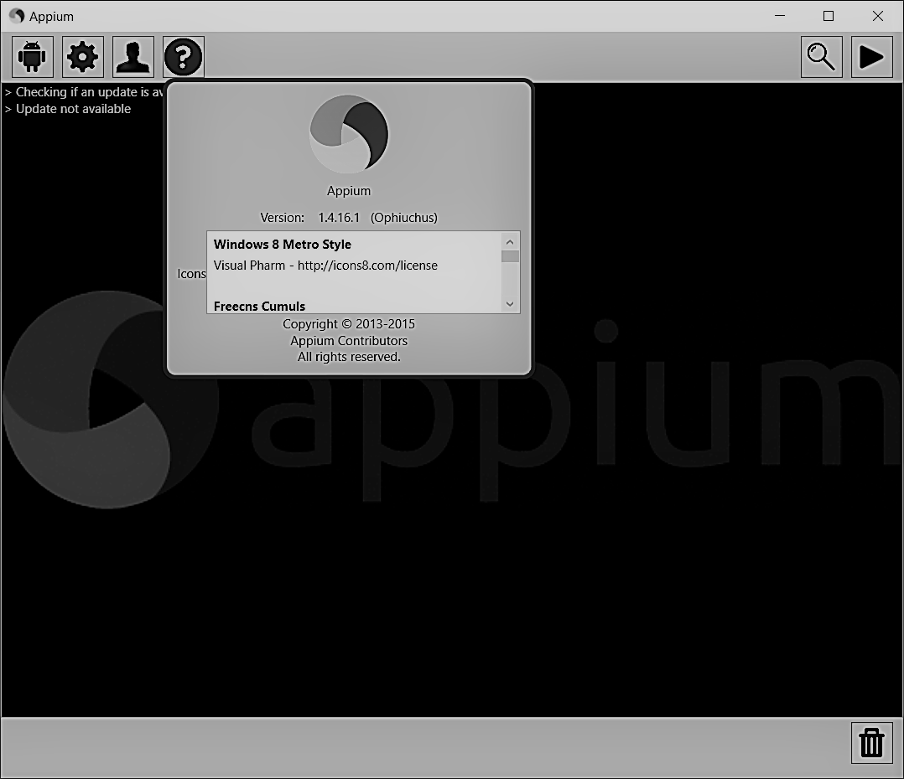

Launch Appium programmatically ( Work Under Progress)
=====================================================

### Windows Support
- Scripts are based on the installation done on windows
- Download Appium from https://bitbucket.org/appium/appium.app/downloads/AppiumForWindows.zip
- Make sure appium.js is latest

    

    (1.4.16.1 was latest while documenting)
#### For Windows installation
    -  node.exe available at
    C:\Program Files (x86)\Appium\node.exe
    -   appium js available at
    C:\Program Files (x86)\Appium\node_modules\appium\bin

#### Script Usage
##### Starting Appium Service
    - run `start_background.bat` which will launch appium service as background
    ( console will be seen)

##### Stop Appium Service
    - run `stop_background.bat` which will stop appium service

> NOTE:
TODO:
1. Add Loggers functionality to trace all appium logs
2. Add Support to MAC
3. Fix Bugs and Refactor code to handle background tasks properly
